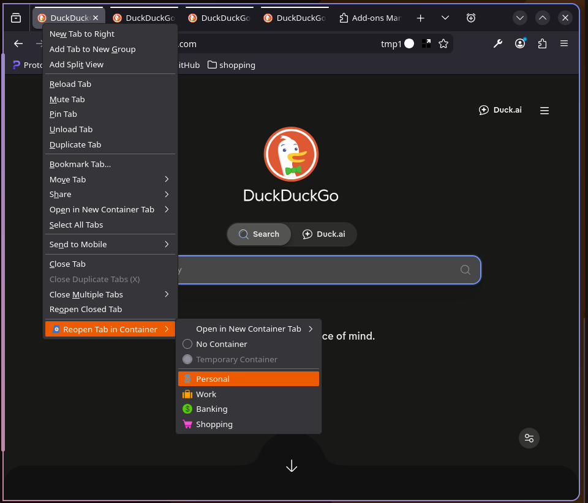
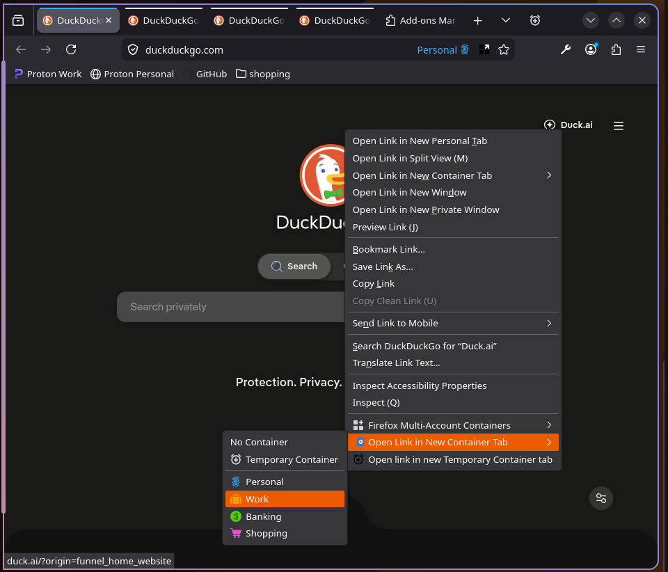
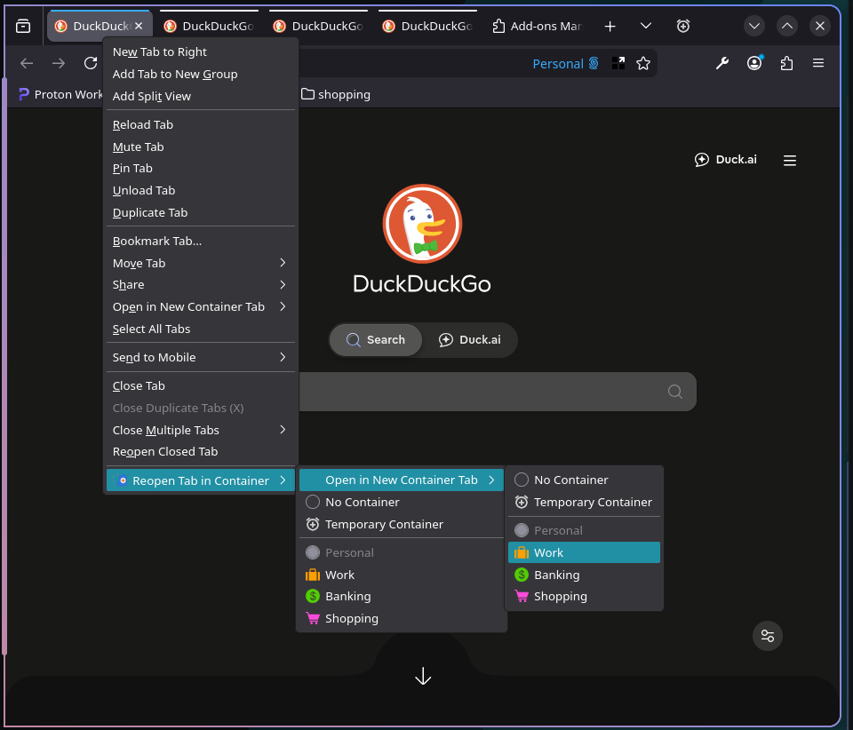
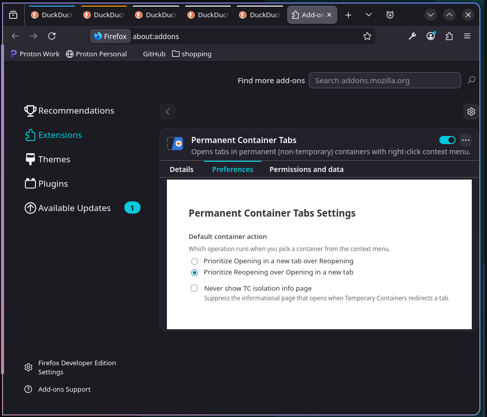

# Permanent Container Tabs

Reopen the current tab in any container, or open a link straight into one — with only your permanent containers in the list.

<p align="left">
  <a href="https://addons.mozilla.org/en-US/firefox/addon/permanent-container-tabs/">
    
    
  </a>
</p>

---

## Why

[*Multi-Account Containers*](https://addons.mozilla.org/en-US/firefox/addon/multi-account-containers/) puts every container in its tab context menu — including every throwaway container that [*Temporary Containers*](https://addons.mozilla.org/en-US/firefox/addon/temporary-containers/) (or [*Temporary Containers Plus*](https://addons.mozilla.org/en-US/firefox/addon/temporary-containers-plus/)) has ever created. If you use Temporary Containers' automatic/global isolation mode, that list grows without bound and your actual permanent containers get buried.

Permanent Container Tabs adds a **Reopen Tab in Container** action: trivially reopen the current tab in a different container without leaving the old tab behind.

If you have [Temporary Containers](https://addons.mozilla.org/en-US/firefox/addon/temporary-containers/) installed, only your **permanent** containers are displayed.

## Compatibility

Works standalone, and integrates with both [*Temporary Containers*](https://addons.mozilla.org/en-US/firefox/addon/temporary-containers/) and [*Temporary Containers Plus*](https://addons.mozilla.org/en-US/firefox/addon/temporary-containers-plus/) if either is installed. Neither is required.

## Usage

<details>
<summary>Reopen the current tab in a container</summary>

Right-click any tab to get the **Reopen Tab in Container** submenu. It lists "No Container", "Temporary Container" (if Temporary Containers or Temporary Containers Plus is installed), and all of your permanent containers. Choosing a different entry closes the current tab and opens a new one at the same URL in the chosen container.



</details>

<details>
<summary>Open a link or bookmark directly in a container</summary>

Right-click any in-page link or bookmark and choose **Open in New Container Tab**. The same container list appears, and the link opens in the chosen container without touching your current tab.



</details>

<details>
<summary>Reach the other action via the alternate submenu</summary>

One action is always the top-level context menu item; the other sits in a nested alternate submenu just below it. You choose which is primary from the settings page.



</details>

<details>
<summary>Configure from the settings page</summary>

The options page lets you swap which of **Open in New Container Tab** / **Reopen Tab in Container** is the top-level item, and lets you disable the Temporary Containers isolation notice.



</details>

---

## Temporary Containers Integration

If Temporary Containers or Temporary Containers Plus is installed, Permanent Container Tabs detects it and adds a "Temporary Container" entry to every container picker, so you can still spin up a disposable container without leaving the menu.

When Temporary Containers' **global isolation mode** is active, it can silently redirect a tab you just opened into a fresh Temporary Container — including one you opened deliberately into a permanent container via the "Reopen" action. Permanent Container Tabs watches for this:

- On reopen, it polls briefly after the new tab is created. If Temporary Containers has intercepted it, Permanent Container Tabs opens an informational page explaining what happened (unless you've suppressed it).
- Independently of reopen, Permanent Container Tabs also watches `tabs.onUpdated` for any tab that lands in a Temporary Container it didn't expect, and shows the same notice.

This is read-only awareness — Permanent Container Tabs never touches Temporary Containers' settings or storage, it only asks "is this cookieStoreId one of yours?" over the WebExtensions messaging API.

## Privacy

Permanent Container Tabs does not collect, transmit, or store anything beyond your local settings (which container action you prefer, and whether to suppress the isolation notice). No network requests, no telemetry.

---

# Contribution

Test your code well before submitting it — there's a Vitest suite covering the menu-building, reopen, and Temporary Containers detection logic; run it before opening a PR.

## Development Build

Using the Nix development shell (recommended in this repo):

```bash
nix develop -c npm install
nix develop -c npm run build:firefox
```

Or without Nix (if `node` and `npm` are already installed):

```bash
npm install
npm run build:firefox
```

This writes `dist/*.zip` (the standard WebExtension build artifact). For a local unsigned `.xpi` file:

```bash
nix develop -c npm run build:firefox:xpi
```

Other useful scripts:

```bash
npm run typecheck   # tsc --noEmit
npm test            # vitest run
```

---

# Slightly more technical details

## Runtime Architecture

- `src/background/pctRuntime.ts`: top-level event wiring — `menus.onShown`/`onHidden`/`onClicked`, `tabs.onUpdated` for the isolation notice.
- `src/background/menuHandler.ts`: builds the tab/link/bookmark context menus and dispatches clicks to open or reopen.
- `src/background/tabReopener.ts`: implements "Reopen Tab in Container", including the TC-intercept poll loop.
- `src/background/tcLayer.ts`: detects Temporary Containers / Temporary Containers Plus, and answers "is this cookieStoreId temporary?" via cross-extension messaging.
- `src/preferences/settings.ts`: settings defaults, validation, and storage load/save.

Permanent Container Tabs only ever shows containers that `tcLayer` reports as *not* temporary — that's the entire trick behind keeping the menu permanent-only.

## Settings

Stored in `browser.storage.local`:

- `prioritizeReopen` (default `false`) — which action is the top-level menu item vs. the nested alternate.
- `suppressIsolationInfo` (default `false`) — never show the isolation notice page.

## Container Menu Items

Two sentinel `cookieStoreId` values are always present alongside your real containers:

- `firefox-default` — "No Container".
- `temp-container` — "Temporary Container", shown only when Temporary Containers or Temporary Containers Plus is detected; creates a fresh temporary container via Temporary Containers' `createTabInTempContainer` message rather than a real `cookieStoreId`.

---

# License

All code is licensed under the [MIT License](./LICENSE).
